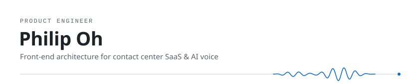

I build contact center software for the web — the screens agents live in all day, and the real-time plumbing underneath them.

I lead UI/UX and front-end architecture at **Furence Cloud Platform**, shipping multi-tenant SaaS for omni-channel CRM, Visual IVR and AI voice. I started out on the other side of the wire as a CTI system engineer, so I know voice from the PBX all the way up to the browser.

### Now

- Designing front-end architecture for multi-tenant contact center SaaS — Micro-Frontend, design system, tenant-level customization
- Bringing AI voice (recording, meeting summaries) into everyday agent workflows
- Taking our products to Japan — Call Center CRM Demo & Conference, Tokyo · Osaka, every year since 2022

### Products

| Product | What it does |
| --- | --- |
| [**Clex 2.0**](https://clex.cloud/) | Omni-channel contact center CRM — voice, chat, email |
| [**ArSee**](https://arsee.ai/) | Visual IVR — ARS menus, on screen |
| [**MoAI**](https://moai-note.ai/) | AI voice notes and meeting summaries |
| [**RecSee 4.0**](https://recsee.net) | AI mobile cloud recording |
| [**Campaign Cloud**](https://campaign.cloud) | Messaging for large-scale campaigns |

### Domains

| Domain | Experience |
| --- | --- |
| 🎧 **Contact Center · AICC** | CTI, omni-channel CRM, Visual IVR, AI voice and call recording |
| 🛒 **eCommerce** | Order, payment and promotions — PG/VAN, L.Pay and Kakao Pay integration, AKMall UI renewal |
| 💳 **Finance** | KB Card next-generation system — DW data migration, ETL batch, data validation |
| 🚗 **Automotive · AVN** | Connected-car infotainment HMI for Toyota / Lexus, Clova AI voice web apps |

### Stack

**🖥 Front-End**

- JavaScript (ES6), TypeScript, HTML5, CSS
- SPA development with React, Vue, Next.js
- Micro-Frontend Architecture (Webpack Module Federation)
- State Management — Redux Toolkit, Zustand
- Data Fetching — React Query, RTK Query
- Real-time Communication — WebSocket, STOMP, SSE
- Design System and component platform design

**📞 Voice & Telephony**

- CTI, IVR / Visual IVR, Call Recording
- SIP, Asterisk (AMI), PBX
- WebRTC

**🛠 Back-End**

- Java (Spring Framework, Spring Boot)
- Microservices Architecture (Spring Cloud, Eureka Service Discovery)
- ORM (JPA, QueryDSL), Mapper (MyBatis)
- RESTful API design and JWT-based authentication
- WebSocket server integration

**🗄 Database**

- PostgreSQL, Oracle, MySQL, MSSQL, Redis
- Index optimization, query tuning, ERD design

**⚙ DevOps / Tools**

- npm, yarn, pnpm, Maven, Gradle
- Jenkins, GitLab CI, TeraStream
- IntelliJ, WebStorm, Cursor, Postman
- AWS, NaverCloud

**🤝 Collaboration**

- Git, SVN
- Notion, Jira, Confluence
- Zoom

### Path

| When | Where | What |
| --- | --- | --- |
| 2022 – now | **Furence** | Product Engineer · UI/UX Unit Leader — Contact Center · AICC |
| 2019 – 2021 | **Obigo** | Software Engineer — Automotive · AVN |
| 2019 | **XGM** | Software Engineer — Finance |
| 2016 – 2019 | **Megazone** | Software Engineer — eCommerce |
| 2011 – 2013 | **Furence** | System Engineer — Contact Center · CTI |

Full story → <a href="https://dev538.notion.site/Product-Engineer-0fdbe82c984946b1ada5633a6d1758f9">Notion portfolio</a>
